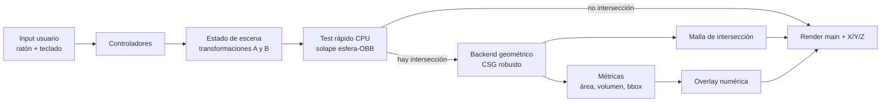
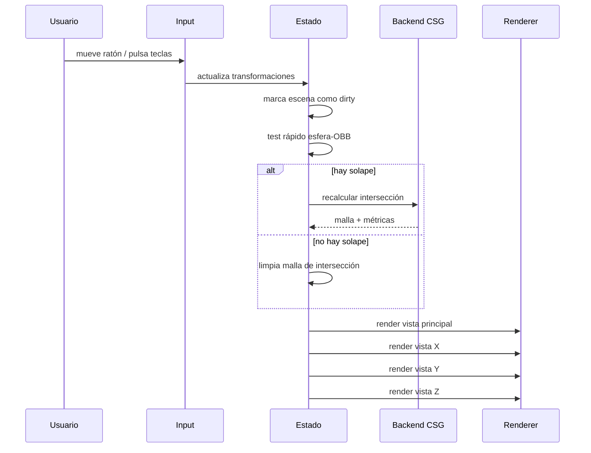

# Diseño de una aplicación 3D interactiva de intersección esfera-cubo

## Resumen ejecutivo

La opción con mejor relación entre alcance, coste de implementación y calidad de despliegue es una **aplicación web** basada en **Three.js** con un backend geométrico desacoplado. Mi recomendación concreta es: **Three.js para escena, cámaras, input y multipanel**, **detección de solape exacta y barata en CPU para esfera contra cubo orientado**, y **cálculo de la malla de intersección con un backend CSG robusto en WebAssembly**, preferiblemente **Manifold**, dejando **WebGPU** como mejora progresiva y no como requisito duro. Esta elección encaja bien con el requisito de priorizar web, porque Three.js ya cubre renderizado en WebGL y WebGPU, y su `WebGPURenderer` puede caer a WebGL 2 cuando WebGPU no esté disponible; además, MDN sigue marcando WebGPU como “limited availability” y restringido a contexto seguro, así que depender de él de forma exclusiva sigue siendo una decisión arriesgada para producción generalista. citeturn6search23turn18view4turn18view5turn5search1

La clave práctica es **separar “detección” de “geometría autoritativa”**. Para saber si hay intersección en cada frame, basta un test analítico esfera–OBB muy barato; para renderizar la región de intersección, calcular **área** y **volumen**, y mostrar sus vistas en X/Y/Z, conviene producir una **malla cerrada de intersección**. Ahí es donde un kernel robusto como **Manifold** aporta valor: está pensado para operar sobre mallas trianguladas manifold, dispone de bindings **JS/WASM**, y su objetivo explícito es la fiabilidad topológica de la salida. Una vez se obtiene esa malla cerrada, las tres vistas ortográficas, los extents por eje y los cálculos de área/volumen se vuelven directos. citeturn20view3turn20view2turn25view0

No recomiendo usar un motor físico como backend principal de la intersección. Es tentador porque ofrecen colisiones, pero sus APIs oficiales se centran en **overlaps**, **raycasts**, **sweeps** y **penetration depth / MTD**; eso sirve para saber *si* penetran y en qué dirección separarlos, pero no para obtener de forma nativa la **malla de la región de intersección** ni su **volumen** y **área**. En otras palabras: ayudan como soporte para interacción o física, no resuelven el problema geométrico pedido. citeturn20view10turn20view9turn10search4turn10search1

Si hubiera una exigencia dura de **exactitud geométrica tipo CAD** para área y volumen —especialmente si la esfera debe tratarse como superficie exacta y no como aproximación triangulada— entonces la recomendación cambia hacia un stack **nativo** con **CGAL** u otro kernel de predicados exactos. Pero para una herramienta interactiva web de dos primitivas, el equilibrio óptimo es un **frontend Three.js** y un **backend CSG robusto en WASM**, con opción de añadir un camino SDF/WebGPU más adelante para previsualización ultra-rápida. citeturn27view1turn19view5turn19view6turn20view6

## Alcance, supuestos y criterios de diseño

Hay varias decisiones no especificadas por el enunciado que conviene fijar desde el inicio para que el diseño no se vuelva ambiguo. Asumo lo siguiente:

- **Objeto A** = esfera, controlado con **ratón**.
- **Objeto B** = cubo, controlado con **teclado**.
- El control base incluye **traslación y rotación**; la **escala** queda fuera del MVP y se deja como ampliación opcional.
- Las tres zonas X/Y/Z muestran **proyecciones ortográficas** de la **malla de intersección**; el modo de **corte por slices** se plantea como ampliación.
- El objetivo de rendimiento es **mantener el render principal por encima de 30 FPS** en hardware de escritorio típico; si el cálculo de métricas se desacopla del frame renderizado, deberá seguir sintiéndose inmediato para el usuario.
- La escena será **oscura**, sin cielo estrellado ni decoración innecesaria, con iluminación mínima para leer bien volumen, caras y solape.

La parte delicada del problema no es dibujar una esfera y un cubo, sino decidir **qué significa “intersección” desde el punto de vista numérico**. En términos de ingeniería, hay tres niveles de “verdad”: la verdad de colisión rápida, la verdad visual y la verdad métrica. En este problema conviene hacerlas converger, pero no necesariamente con el mismo algoritmo. La literatura sobre mesh booleans insiste en que las operaciones booleanas sobre mallas son notoriamente frágiles frente a degeneraciones numéricas; los enfoques con predicados exactos o kernels robustos mejoran mucho la fiabilidad, a costa de más complejidad de implementación. En paralelo, la literatura específica de esfera–cubo deja claro que no existe una solución analítica única y cómoda para todos los escenarios prácticos de volumen de intersección, y por eso compara soluciones numéricas y aproximaciones. citeturn27view0turn27view1turn20view6

La consecuencia práctica es importante: **si el objetivo principal es una aplicación interactiva usable y mantenible**, no merece la pena empezar por una solución analítica monolítica para todo. Es mejor diseñar una arquitectura con un **test exacto barato** para decidir solape y una **representación geométrica robusta** para visualización y métricas. Esa separación reduce riesgo técnico sin sacrificar la calidad percibida. citeturn27view0turn20view3turn25view0

## Evaluación de stacks y recomendación

Three.js ofrece una base muy fuerte para este caso porque cubre la escena, cámaras en perspectiva y ortográficas, picking por raycasting, controles de transformación, viewports múltiples y render targets. Además, su ruta WebGPU existe y su documentación oficial indica que el `WebGPURenderer` intenta usar un backend WebGPU y, si no puede, cae a WebGL 2, lo que permite tratar WebGPU como mejora progresiva. En cambio, en los motores nativos, tanto el CSG integrado de Godot como el boolean editor de Unity tienen advertencias claras de orientación a prototipado o estado experimental, lo que les resta atractivo como base de runtime para este caso concreto. citeturn18view2turn18view3turn24search6turn6search1turn6search2turn18view4turn19view0turn19view1turn29view0turn29view1

| Stack | Encaje con el problema | Ruta de intersección recomendada | Ventajas | Riesgos / límites | Licencia |
|---|---|---|---|---|---|
| **Three.js + Manifold WASM** | **Muy alto** | CSG robusto de malla en worker; render con WebGL/WebGPU | Web-first, despliegue inmediato, geometría robusta, vistas X/Y/Z fáciles | La esfera es una aproximación triangulada salvo que añadas ruta implícita/SDF | Three.js MIT; Manifold Apache-2.0 |
| **Three.js + SDF / voxel + Marching Cubes** | Alto | Intersección implícita por SDF; volumen por muestreo; área por extracción de isosuperficie | Muy flexible, ideal para GPU, proyecciones y cortes sencillos | Métricas aproximadas según resolución; más trabajo shader/compute | Three.js MIT |
| **Unity + compute shaders + backend propio** | Medio | Compute/voxel o plugin C++ | Buen tooling nativo y pipeline GPU maduro | El boolean de ProBuilder es experimental; modelo de licencia/planes y despliegue web menos natural | Propietario / términos comerciales |
| **Godot + compute shaders + GDExtension** | Medio | Compute/voxel; CSG solo para prototipos | MIT, buen motor open source | La propia documentación desaconseja CSG runtime por coste CPU; compute con caveats en móvil | MIT |
| **C++ nativo + CGAL/OpenVDB** | Muy alto si prima exactitud | Corefinement/Boolean exacto o level sets | Máxima robustez y control | Coste de desarrollo muy superior; peor time-to-first-demo | CGAL dual GPL/LGPL/comercial; OpenVDB con documentación oficial inconsistente de licencia, a verificar |

Fuentes resumidas en la tabla: Three.js documenta renderizadores WebGL/WebGPU, cámaras, controles y viewports; **Manifold** se presenta como librería robusta para mallas trianguladas manifold con bindings JS/WASM; **Unity** documenta el boolean de ProBuilder como experimental y su editor bajo términos comerciales; **Godot** advierte coste CPU significativo del CSG y soporte de compute shaders con limitaciones; **CGAL** ofrece corefinement/booleans y mediciones de área/volumen; **OpenVDB** documenta CSG sobre level sets, pero sus páginas oficiales consultadas muestran incoherencia de licencia entre el sitio y el repositorio, por lo que conviene verificar ese punto antes de adoptar la biblioteca. citeturn18view4turn19view0turn19view1turn19view3turn19view4turn20view3turn20view2turn19view5turn19view6turn19view7turn19view9turn19view10turn16search9turn4search0turn12search0turn4search5

Mi recomendación final, por tanto, es la siguiente. **Si el objetivo es un producto web interactivo**, empieza con **Three.js** y encapsula el backend geométrico detrás de una interfaz. Usa **three-bvh-csg** o incluso un CSG más simple para un primer prototipo funcional rápido, pero pasa a **Manifold** en cuanto el comportamiento básico esté validado. Reserva **WebGPU** para una segunda fase como camino de optimización o preview implícita. Solo daría el salto a nativo si el requisito dominante fuera exactitud casi-CAD, integración con bibliotecas geométricas de escritorio o distribución fuera del navegador. citeturn31search0turn20view7turn26search12turn20view3turn18view4turn18view5

## Métodos de intersección y recomendación técnica

### Analítica esfera-cubo

El enfoque analítico parece, a primera vista, el más elegante: una esfera y un cubo son primitivas simples, así que uno podría pensar que volumen, área y región de intersección deberían salir “fácilmente”. El problema es que eso solo es cierto en escenarios restringidos. La literatura que estudia el volumen de intersección esfera–cubo en contextos de simulación remarca precisamente que **no existe una solución analítica única y cómoda** para el problema general de uso práctico, y por eso compara técnicas numéricas y aproximaciones de distinta calidad. Desde el punto de vista de ingeniería, eso significa que la analítica es excelente para el **test rápido de solape**, pero mala candidata como pilar único para todo el ciclo de visualización, métricas y extensibilidad. citeturn20view6

Mi recomendación aquí es pragmática: usa la analítica **solo** donde es claramente superior, es decir, para una fase de **narrow phase rápida en CPU**. Con un cubo orientado, basta llevar el centro de la esfera al espacio local del cubo, proyectarlo al punto más cercano de la caja, y comparar esa distancia con el radio. Ese test será exacto para el solape binario, muy estable y casi gratis computacionalmente. A partir de ahí, si no hay solape, evitas lanzar el boolean caro; si lo hay, disparas el backend geométrico. Esta es la mejor forma de aprovechar la simplicidad del caso sin dejarte atrapar por la complejidad de una solución cerrada para todo.

### Boolean de malla

El boolean de malla es el método más equilibrado para este problema porque produce exactamente la **forma** que luego necesitas renderizar en el viewport principal y también en las tres vistas X/Y/Z. Su desventaja clásica es la **fragilidad numérica**: la intersección triángulo–triángulo y el remallado local generan degeneraciones, coplanaridades y errores de clasificación. Precisamente por eso los trabajos más serios del área se concentran en predicados exactos, construcciones exactas o garantías topológicas. El paper de Cherchi, Pellacini, Attene y Livesu resume bien el problema: los mesh booleans son conceptualmente simples, pero computacionalmente traicioneros, y los enfoques robustos con garantías solían quedar relegados a offline hasta propuestas recientes capaces de rendir a tasas interactivas en mallas bastante grandes. citeturn27view0

Dentro de esta familia, hay tres niveles muy distintos. **CGAL** ofrece corefinement y mezcla de bounded volumes con operaciones booleanas y, además, un paquete de medidas para área y volumen; es una referencia fuerte si aceptas un stack C++ y sus implicaciones de licencia. **Manifold** se sitúa en un punto muy atractivo para web porque está orientado a mallas trianguladas manifold, promete salida manifold fiable y tiene bindings JS/WASM. **three-bvh-csg** es útil para MVP y demos rápidas porque su API es compacta y está optimizado con estructuras BVH y half-edge, pero su propio repositorio lo define como experimental y su issue tracker muestra todavía trabajo abierto en robustez y casos coplanares. citeturn19view5turn19view6turn20view3turn20view2turn20view7turn20view8turn26search12

Para este caso concreto, el boolean de malla tiene una ventaja decisiva: una vez calculada la malla de intersección, el resto del problema se simplifica muchísimo. La **superficie** es la suma del área de sus triángulos y el **volumen** es el del dominio acotado por una malla cerrada triangulada. CGAL lo documenta explícitamente con funciones de `area()` y `volume()` sobre superficies trianguladas cerradas. En implementación propia en JavaScript, esto se traduce en sumar áreas de triángulos y el volumen firmado por tetraedros respecto del origen, siempre que la malla esté orientada y cerrada. citeturn25view0

### Voxelización y level sets

La voxelización y los level sets son muy buenos cuando la robustez te importa más que la exactitud cerrada. OpenVDB documenta operaciones CSG de intersección, unión y diferencia sobre level sets con **sparse traversal**, lo que da una pista clara de por qué esta familia funciona bien en entornos de volúmenes dispersos. Su gran virtud es que evita muchos de los dolores clásicos de la topología de mallas: una vez todo vive en una rejilla o campo escalar, las operaciones booleanas son más regulares y menos propensas a patología combinatoria. citeturn19view7

El precio es conocido: cuanto más fina sea la rejilla, mejor aproximas, pero más memoria y tiempo pagas. Para este problema, voxel/SDF es especialmente cómodo si quieres mostrar **cortes** o **proyecciones**; también es natural para computar volumen como conteo o integración sobre celdas ocupadas. El área requiere extraer una isosuperficie, normalmente con **Marching Cubes**, lo que introduce otra aproximación dependiente de resolución. Three.js incluye un objeto `MarchingCubes` como addon, y el algoritmo original de Lorensen y Cline sigue siendo la referencia clásica para extracción de isosuperficies desde datos volumétricos. citeturn20view14turn8search1

### GPU y compute shaders

El camino GPU tiene dos sabores. El primero es **render-only**: representar la intersección implícitamente en shader, por ejemplo con SDF de esfera y caja, y usar esa representación para colorear la región o producir slices/proyecciones. El segundo es **compute**: discretizar el volumen de interés, muestrear ocupación en una malla 3D y reducir en GPU para estimar volumen, o extraer geometría a partir del campo. La ventaja es obvia: paralelismo masivo y latencia muy baja cuando el pipeline está bien afinado. MDN presenta WebGPU precisamente como la evolución de WebGL con soporte explícito para computación general sobre GPU. citeturn18view5

Aunque esto suena ideal, no conviene sobredimensionar su papel en el MVP web. WebGPU sigue figurando como no-Baseline en MDN y exige HTTPS; además, aunque Three.js permite una entrada progresiva con fallback, una implementación compute completa aumenta bastante la complejidad de desarrollo y depuración. En motores nativos, Unity y Godot documentan compute shaders de forma oficial; Godot añade además una advertencia relevante: el soporte en móvil es generalmente pobre por problemas de drivers. Mi conclusión es que GPU/compute debe verse como **acelerador** o **segunda fase**, no como la base mínima del proyecto. citeturn18view4turn18view5turn19view3turn28view0

### Comparativa de métodos

| Método | Exactitud geométrica | Robustez numérica | Rendimiento interactivo | Facilidad para vistas X/Y/Z | Complejidad de implementación | Recomendación |
|---|---|---|---|---|---|---|
| Analítico esfera–cubo | Muy alta para test de solape; problemática para volumen/área generalizados | Alta en test; baja mantenibilidad para el caso completo | Excelente | Baja si necesitas la geometría completa | Alta | Úsalo solo para gating y colisión rápida |
| Boolean de malla robusto | Alta sobre la malla de entrada | Alta si usas kernels robustos | Buena para dos primitivas | Muy alta | Media/alta | **Opción principal** |
| Voxel / SDF | Media–alta según resolución | Muy alta | Buena, excelente en GPU | Muy alta | Media | Opción sólida para preview, slices y fallback robusto |
| GPU compute puro | Media–alta según resolución/discretización | Alta | Muy alta en hardware compatible | Muy alta | Alta | Mejora futura, no MVP |
| Motor físico | Baja para este requisito geométrico | Alta para colisión | Muy buena | Muy baja | Baja/media | No usar como backend principal |

Fuentes de la tabla: el trabajo sobre mesh booleans robustos subraya la dificultad numérica de los booleans de malla y la necesidad de predicados exactos o kernels cuidadosamente diseñados; el trabajo de Bruno Lévy muestra un camino de CSG exacto con predicados y construcciones exactas; OpenVDB documenta intersección de level sets con sparse traversal; Three.js documenta `MarchingCubes`; PhysX documenta que sus geometry queries se centran en overlaps, raycasts, sweeps y MTD; la bibliografía específica esfera–cubo remarca la ausencia de una solución analítica única conveniente para todas las variantes de volumen de intersección. citeturn27view0turn27view1turn19view7turn20view14turn20view10turn20view6

La recomendación combinada que considero más sólida es esta: **test analítico CPU para solape** + **boolean robusto de malla como geometría autoritativa** + **ruta SDF/voxel opcional para preview o futura aceleración GPU**. De ese modo, el render principal y las métricas no dependen de un motor físico, evitamos el peor coste de una analítica global, y mantenemos una vía natural para ampliar a slices, heatmaps o cómputo volumétrico en GPU más adelante. citeturn20view3turn25view0turn18view5

## Arquitectura, UI y flujo de render

La UI que mejor encaja con el requisito es una composición **1+3**: un viewport principal grande y tres paneles secundarios para X, Y y Z. En el principal se muestran esfera, cubo e intersección con cámara en perspectiva; en los secundarios se renderiza **solo la malla de intersección** con cámaras ortográficas alineadas con cada eje. Three.js documenta tanto las cámaras ortográficas como los métodos de `setViewport()` y `setScissor()` del renderer, que son exactamente lo que hace falta para multiplexar varias vistas dentro del mismo canvas. citeturn6search1turn6search2turn24search6

Propongo además una barra superior o lateral con métricas: **volumen**, **área**, y para cada eje los intervalos **[min, max]** y su amplitud **Δx, Δy, Δz**. Es una decisión muy útil porque reduce ambigüedad visual: las cámaras secundarias enseñan la geometría desde X/Y/Z, mientras que la overlay numérica responde a “qué tan grande es la intersección” en cada eje. El usuario no tiene que inferirlo solo por perspectiva.

```text
┌────────────────────────── Viewport principal ──────────────────────────┬──────── X ────────┐
│ esfera + cubo + región de intersección                                │ ortho sobre X     │
│ cámara perspectiva, fondo oscuro, luces simples                       ├──────── Y ────────┤
│ gizmo de ratón para objeto A                                           │ ortho sobre Y     │
│ overlay: volumen, área, Δx, Δy, Δz                                    ├──────── Z ────────┤
│                                                                        │ ortho sobre Z     │
└────────────────────────────────────────────────────────────────────────┴───────────────────┘
```

El control del ratón encaja bien con `TransformControls`, que soporta explícitamente modos de `translate`, `rotate` y `scale`; para este proyecto usaría solo `translate` y `rotate` en el MVP. Si quieres picking manual o seleccionar primitivas en el futuro, `Raycaster` sigue siendo la herramienta estándar en Three.js para llevar coordenadas NDC del ratón a intersecciones sobre objetos 3D. citeturn18view2turn18view3

En arquitectura interna conviene aislar el cálculo geométrico del render y del input. Si la intersección se recalcula únicamente cuando cambian las transformaciones, un patrón **dirty flag** es suficiente. Y si el backend booleano empieza a costar más de lo tolerable, la Web Platform permite mover ese trabajo a **Web Workers**; MDN y OffscreenCanvas dejan claro que el trabajo pesado puede sacarse del hilo principal para que la UI no se bloquee. En este proyecto yo movería primero el **boolean** al worker; el render puede quedarse en el hilo principal salvo que el perfil real diga lo contrario. citeturn20view11turn20view12





## Implementación web de referencia

La implementación de referencia que propongo tiene dos niveles. El primero es un **MVP ejecutable corto** con **Three.js + `three-bvh-csg`**, porque su API es compacta y permite enseñar todo el pipeline de forma entendible. El segundo, recomendado para endurecer el proyecto, sustituye el backend booleano por **Manifold en un worker**. La abstracción del backend debe hacerse desde el principio para que el cambio no rompa la UI. `three-bvh-csg` es rápido, usa BVH y half-edge, pero su autor lo sigue marcando como experimental; **Manifold** es la base más adecuada cuando la robustez pasa a ser prioritaria. citeturn20view7turn20view8turn26search12turn20view3turn20view2

### Dependencias recomendadas

Para el MVP web:

```bash
npm create vite@latest interseccion-3d -- --template vanilla-ts
cd interseccion-3d
npm install three three-bvh-csg lil-gui stats.js
npm install -D typescript @types/three vite eslint vitest
```

Para endurecer la solución:

```bash
npm install manifold-3d comlink
```

Si decides meter WebGPU o inicialización WASM más compleja, conviene fijar bien el bundler y no dejar versiones flotantes en CI. Three.js distribuye renderizadores WebGL y WebGPU; `three-bvh-csg` se apoya en `three-mesh-bvh`; y Manifold está disponible como módulo JS/WASM. citeturn6search23turn31search9turn21search2

### Escena, cámaras y objetos

```ts
// src/main.ts
import * as THREE from 'three';
import { OrbitControls } from 'three/addons/controls/OrbitControls.js';
import { TransformControls } from 'three/addons/controls/TransformControls.js';
import { Brush, Evaluator, INTERSECTION } from 'three-bvh-csg';

const canvas = document.querySelector<HTMLCanvasElement>('#app')!;

const renderer = new THREE.WebGLRenderer({ canvas, antialias: true });
renderer.setPixelRatio(Math.min(window.devicePixelRatio, 2));
renderer.setSize(window.innerWidth, window.innerHeight);
renderer.setScissorTest(true);

const scene = new THREE.Scene();
scene.background = new THREE.Color(0x0b0d10); // escena oscura, sin estrellas

const mainCamera = new THREE.PerspectiveCamera(55, window.innerWidth / window.innerHeight, 0.1, 100);
mainCamera.position.set(6, 5, 8);

const camX = new THREE.OrthographicCamera(-4, 4, 4, -4, 0.1, 100);
const camY = new THREE.OrthographicCamera(-4, 4, 4, -4, 0.1, 100);
const camZ = new THREE.OrthographicCamera(-4, 4, 4, -4, 0.1, 100);

// Miradas ortográficas para los tres paneles
camX.position.set(10, 0, 0); camX.up.set(0, 1, 0); camX.lookAt(0, 0, 0);
camY.position.set(0, 10, 0); camY.up.set(0, 0, -1); camY.lookAt(0, 0, 0);
camZ.position.set(0, 0, 10); camZ.up.set(0, 1, 0); camZ.lookAt(0, 0, 0);

const orbit = new OrbitControls(mainCamera, renderer.domElement);
orbit.enableDamping = true;

scene.add(new THREE.AmbientLight(0xffffff, 0.25));

const dir1 = new THREE.DirectionalLight(0xffffff, 1.0);
dir1.position.set(4, 8, 6);
scene.add(dir1);

const dir2 = new THREE.DirectionalLight(0xffffff, 0.35);
dir2.position.set(-6, 3, -4);
scene.add(dir2);

// Objeto A (ratón): esfera
const sphere = new THREE.Mesh(
  new THREE.SphereGeometry(1.35, 48, 32),
  new THREE.MeshStandardMaterial({ color: 0x4fa3ff, metalness: 0.1, roughness: 0.6 })
);
sphere.position.set(-1.2, 0.0, 0.0);

// Objeto B (teclado): cubo
const cube = new THREE.Mesh(
  new THREE.BoxGeometry(2.4, 2.4, 2.4),
  new THREE.MeshStandardMaterial({ color: 0xffa24f, metalness: 0.05, roughness: 0.7 })
);
cube.position.set(1.2, 0.0, 0.0);

scene.add(sphere, cube);

// Malla visible de la intersección
const intersectionMesh = new THREE.Mesh(
  new THREE.BufferGeometry(),
  new THREE.MeshStandardMaterial({
    color: 0x9dff8b,
    transparent: true,
    opacity: 0.75,
    metalness: 0.0,
    roughness: 0.35,
    emissive: 0x2b5f19,
    emissiveIntensity: 0.6
  })
);

// Solo las cámaras secundarias verán esta capa
intersectionMesh.layers.set(1);
camX.layers.set(1);
camY.layers.set(1);
camZ.layers.set(1);

scene.add(intersectionMesh);
```

### Input de ratón y teclado

```ts
const transform = new TransformControls(mainCamera, renderer.domElement);
transform.attach(sphere);
transform.setMode('translate'); // alternar con 'rotate'
scene.add(transform.getHelper());

transform.addEventListener('mouseDown', () => orbit.enabled = false);
transform.addEventListener('mouseUp', () => orbit.enabled = true);

window.addEventListener('keydown', (ev) => {
  // Supuesto: T = translate, R = rotate
  if (ev.code === 'KeyT') transform.setMode('translate');
  if (ev.code === 'KeyR') transform.setMode('rotate');
});

const keyState = new Set<string>();
window.addEventListener('keydown', (e) => keyState.add(e.code));
window.addEventListener('keyup', (e) => keyState.delete(e.code));

function updateKeyboardCube(dt: number) {
  const move = 2.5 * dt;
  const rot = 1.6 * dt;

  // Traslación asumida: WASDQE
  if (keyState.has('KeyA')) cube.position.x -= move;
  if (keyState.has('KeyD')) cube.position.x += move;
  if (keyState.has('KeyW')) cube.position.z -= move;
  if (keyState.has('KeyS')) cube.position.z += move;
  if (keyState.has('KeyQ')) cube.position.y += move;
  if (keyState.has('KeyE')) cube.position.y -= move;

  // Rotación asumida: IJKLUO
  if (keyState.has('KeyJ')) cube.rotation.y += rot;
  if (keyState.has('KeyL')) cube.rotation.y -= rot;
  if (keyState.has('KeyI')) cube.rotation.x += rot;
  if (keyState.has('KeyK')) cube.rotation.x -= rot;
  if (keyState.has('KeyU')) cube.rotation.z += rot;
  if (keyState.has('KeyO')) cube.rotation.z -= rot;
}
```

### Test rápido de solape y backend de intersección

El test rápido evita ejecutar el boolean cuando claramente no hay intersección. En el MVP, el backend de intersección puede ser `three-bvh-csg`. En producción, esa función debería vivir detrás de una interfaz intercambiable y poder despachar a un worker con Manifold. citeturn20view7turn20view3turn20view2

```ts
const evaluator = new Evaluator();

function sphereIntersectsOrientedBox(
  sphereCenterWorld: THREE.Vector3,
  radius: number,
  boxWorldMatrix: THREE.Matrix4,
  halfSize: THREE.Vector3
): boolean {
  const inv = new THREE.Matrix4().copy(boxWorldMatrix).invert();
  const p = sphereCenterWorld.clone().applyMatrix4(inv);

  const closest = new THREE.Vector3(
    THREE.MathUtils.clamp(p.x, -halfSize.x, halfSize.x),
    THREE.MathUtils.clamp(p.y, -halfSize.y, halfSize.y),
    THREE.MathUtils.clamp(p.z, -halfSize.z, halfSize.z)
  );

  return closest.distanceToSquared(p) <= radius * radius;
}

function makeBrushFromMesh(mesh: THREE.Mesh): Brush {
  const g = (mesh.geometry as THREE.BufferGeometry).clone();
  g.computeVertexNormals();

  const brush = new Brush(g);
  brush.position.copy(mesh.position);
  brush.quaternion.copy(mesh.quaternion);
  brush.scale.copy(mesh.scale);
  brush.updateMatrixWorld(true);
  return brush;
}

function updateIntersectionGeometry() {
  const overlap = sphereIntersectsOrientedBox(
    sphere.getWorldPosition(new THREE.Vector3()),
    1.35 * sphere.scale.x,             // MVP: escala uniforme
    cube.matrixWorld,
    new THREE.Vector3(1.2, 1.2, 1.2).multiply(cube.scale)
  );

  if (!overlap) {
    intersectionMesh.visible = false;
    return;
  }

  const a = makeBrushFromMesh(sphere);
  const b = makeBrushFromMesh(cube);

  const resultBrush = evaluator.evaluate(a, b, INTERSECTION);
  const worldGeom = resultBrush.geometry.clone();
  worldGeom.applyMatrix4(resultBrush.matrixWorld);
  worldGeom.computeVertexNormals();

  intersectionMesh.geometry.dispose();
  intersectionMesh.geometry = worldGeom;
  intersectionMesh.visible = true;

  const metrics = computeMeshMetrics(worldGeom);
  updateOverlay(metrics);
}
```

### Cálculo de volumen, área y extents por eje

```ts
type Metrics = {
  volume: number;
  area: number;
  min: THREE.Vector3;
  max: THREE.Vector3;
  size: THREE.Vector3;
};

function computeMeshMetrics(geometry: THREE.BufferGeometry): Metrics {
  const g = geometry.index ? geometry.toNonIndexed() : geometry.clone();
  const pos = g.getAttribute('position') as THREE.BufferAttribute;

  let area = 0;
  let volume = 0;

  const a = new THREE.Vector3();
  const b = new THREE.Vector3();
  const c = new THREE.Vector3();
  const ab = new THREE.Vector3();
  const ac = new THREE.Vector3();
  const cross = new THREE.Vector3();

  const box = new THREE.Box3().setFromBufferAttribute(pos);

  for (let i = 0; i < pos.count; i += 3) {
    a.fromBufferAttribute(pos, i + 0);
    b.fromBufferAttribute(pos, i + 1);
    c.fromBufferAttribute(pos, i + 2);

    ab.subVectors(b, a);
    ac.subVectors(c, a);
    cross.crossVectors(ab, ac);

    area += 0.5 * cross.length();
    volume += a.dot(new THREE.Vector3().crossVectors(b, c)) / 6.0;
  }

  return {
    volume: Math.abs(volume),
    area,
    min: box.min.clone(),
    max: box.max.clone(),
    size: box.getSize(new THREE.Vector3())
  };
}

function updateOverlay(m: Metrics) {
  const el = document.getElementById('metrics')!;
  el.innerHTML = `
    <div>Volumen: ${m.volume.toFixed(4)}</div>
    <div>Área: ${m.area.toFixed(4)}</div>
    <div>X: [${m.min.x.toFixed(3)}, ${m.max.x.toFixed(3)}]  Δx=${m.size.x.toFixed(3)}</div>
    <div>Y: [${m.min.y.toFixed(3)}, ${m.max.y.toFixed(3)}]  Δy=${m.size.y.toFixed(3)}</div>
    <div>Z: [${m.min.z.toFixed(3)}, ${m.max.z.toFixed(3)}]  Δz=${m.size.z.toFixed(3)}</div>
  `;
}
```

### Renderizado en cuatro zonas de pantalla

```ts
function renderPanel(x: number, y: number, w: number, h: number, camera: THREE.Camera) {
  renderer.setViewport(x, y, w, h);
  renderer.setScissor(x, y, w, h);
  renderer.render(scene, camera);
}

function renderAllViews() {
  const w = window.innerWidth;
  const h = window.innerHeight;

  const side = Math.floor(w * 0.28);
  const mainW = w - side;
  const panelH = Math.floor(h / 3);

  // Viewport principal
  mainCamera.layers.enableAll();
  renderPanel(0, 0, mainW, h, mainCamera);

  // Paneles laterales: solo capa de intersección
  renderPanel(mainW, h - panelH, side, panelH, camX);
  renderPanel(mainW, h - 2 * panelH, side, panelH, camY);
  renderPanel(mainW, h - 3 * panelH, side, panelH, camZ);
}
```

### Bucle principal y actualización bajo demanda

```ts
const clock = new THREE.Clock();
let dirty = true;

transform.addEventListener('objectChange', () => { dirty = true; });

function animate() {
  requestAnimationFrame(animate);
  const dt = clock.getDelta();

  updateKeyboardCube(dt);
  orbit.update();

  // Si el cubo ha cambiado por teclado, recalcular
  if (keyState.size > 0) dirty = true;

  if (dirty) {
    sphere.updateMatrixWorld(true);
    cube.updateMatrixWorld(true);
    updateIntersectionGeometry();
    dirty = false;
  }

  renderAllViews();
}

animate();

window.addEventListener('resize', () => {
  renderer.setSize(window.innerWidth, window.innerHeight);
  mainCamera.aspect = window.innerWidth / window.innerHeight;
  mainCamera.updateProjectionMatrix();
});
```

### Ruta endurecida con worker y backend robusto

Para producción, la firma que conviene fijar desde el inicio es algo así:

```ts
export interface BooleanBackend {
  intersect(
    spherePose: { position: [number, number, number]; rotation: [number, number, number, number]; radius: number; segments: number },
    cubePose:   { position: [number, number, number]; rotation: [number, number, number, number]; halfSize: [number, number, number] }
  ): Promise<{
    positions: Float32Array;
    indices: Uint32Array;
    normals?: Float32Array;
  } | null>;
}
```

Con esta interfaz, el MVP puede usar `three-bvh-csg` en el hilo principal y la versión endurecida puede hablar con un **worker** que invoque **Manifold**. La documentación JS/WASM de Manifold incluso incluye un `ExecutionContext` pensado para observar ejecuciones largas y cancelación segura desde threads/workers, lo que encaja muy bien con escenas interactivas donde el usuario sigue arrastrando un objeto mientras un cálculo previo ya no interesa. citeturn20view2

### Idea de shader para previsualizar la intersección

Si más adelante quieres una preview instantánea aún más fluida, puedes usar una representación implícita en shader y colorear la región de intersección sin esperar al boolean autoritativo. El patrón conceptual es este:

```glsl
// Esfera: SDF exacta
float sdSphere(vec3 p, vec3 c, float r) {
  return length(p - c) - r;
}

// Caja orientada: llevar al espacio local del cubo y usar SDF de caja
float sdBox(vec3 pLocal, vec3 b) {
  vec3 q = abs(pLocal) - b;
  return length(max(q, 0.0)) + min(max(q.x, max(q.y, q.z)), 0.0);
}

// Con convención interior negativo:
float dIntersection = max(dSphere, dBox);

// Resaltado visual cerca de la frontera
float glow = smoothstep(0.03, 0.0, abs(dIntersection));
vec3 color = mix(baseColor, vec3(0.7, 1.0, 0.55), glow);
```

Ese shader no sustituye por sí mismo a las métricas autoritativas, pero sirve de **preview visual inmediata** o de base para una futura ruta SDF/WebGPU.

## Rendimiento, validación y plan de trabajo

El objetivo realista de rendimiento no debe formularse como “hacer booleans exactos cada frame pase lo que pase”, sino como **mantener el render interactivo suave** mientras el backend geométrico solo trabaja cuando hace falta. Con dos primitivas la rasterización no será el cuello de botella; el coste vendrá del boolean, de la conversión a malla si eliges Marching Cubes, o de transferencias entre hilos si el worker está mal diseñado. La web plataforma ofrece dos herramientas claras para esto: **Web Workers** para sacar trabajo pesado del hilo principal, y **OffscreenCanvas** si finalmente necesitas mover también parte del render. citeturn20view11turn20view12

Las optimizaciones que considero de mayor retorno son estas. Primero, **broad phase analítica** antes del boolean. Segundo, **dirty flags**: no recalcular si ninguna transformación ha cambiado. Tercero, **reuse** de materiales, cámaras y contenedores de geometría; evita crear objetos temporales masivamente en el bucle. Cuarto, baja el coste de la esfera ajustando su tessellation a un punto razonable; para el MVP, una esfera de 32–48 segmentos suele ser suficiente visualmente. Quinto, si usas `three-bvh-csg`, asume que es un backend de prototipo y perfílalo con casos tangenciales y coplanares; si aparecen rarezas, el siguiente paso no es parchear la UI sino cambiar el backend a Manifold. Esta prioridad importa porque el repositorio de `three-bvh-csg` sigue llamándolo experimental y mantiene incidencias abiertas relacionadas con robustez y triángulos coplanares. citeturn20view7turn26search12

En los motores nativos, la historia no cambia demasiado. Godot documenta que sus nodos CSG están orientados al prototipado y tienen coste significativo de CPU, especialmente al mover nodos CSG durante gameplay; Unity, por su parte, documenta el Boolean Tool de ProBuilder como experimental. Eso refuerza mi conclusión de que el valor no está en “el motor con CSG integrado”, sino en **un backend geométrico explícito y controlado**. citeturn19view0turn19view1turn29view0turn29view1

### Checklist de pruebas

- Verificar que la esfera con ratón permite **traslación** y **rotación** sin bloquear la cámara permanentemente.
- Verificar que el cubo responde a teclado incluso tras perder y recuperar foco de ventana.
- Probar casos de **no solape**, **solape parcial**, **casi tangencia**, **contención parcial** y **rotación coplanar**.
- Verificar que las vistas X/Y/Z muestran **solo** la malla de intersección y no los objetos originales.
- Verificar que volumen y área vuelven a cero o desaparecen al separar objetos.
- Probar redimensionado de ventana y diferentes DPR.
- Medir FPS con el objeto quieto y en arrastre continuo.
- Comprobar fugas de memoria al regenerar geometría repetidamente.
- Si usas worker, comprobar cancelación o descarte de resultados obsoletos.
- Si introduces SDF/voxel, validar sensibilidad a la resolución y documentar el error aceptable.

### Cronograma recomendado

| Fase | Duración orientativa | Resultado |
|---|---:|---|
| Base visual | 2–3 días | Escena oscura, iluminación, cámara principal, paneles X/Y/Z |
| Interacción | 2–3 días | Ratón con `TransformControls`, teclado para el cubo, overlay básica |
| MVP geométrico | 3–5 días | Boolean con `three-bvh-csg`, métrica de área/volumen y extents |
| Endurecimiento | 4–6 días | Abstracción de backend, worker, sustitución por Manifold |
| Optimización | 3–5 días | Dirty flags finos, profiling, tuning de tessellation y GC |
| Mejora avanzada | 4–7 días | Ruta SDF/WebGPU opcional, slices, resaltado shader y validación final |

### Conclusión de ingeniería

Si hoy tuviera que arrancar el proyecto, mi hoja de ruta sería muy concreta: **Three.js + WebGLRenderer** para el MVP, **panel 1+3** con cámaras ortográficas, **test analítico CPU** para decidir cuándo recalcular, **backend CSG inicial con `three-bvh-csg`** por velocidad de prototipado, y una **interfaz de backend** lista desde el primer día para migrar a **Manifold WASM** en cuanto se verifique el flujo UX. Esa ruta maximiza velocidad de entrega sin hipotecar robustez futura. Si más adelante el producto exige mejores previews o slices dinámicos, entonces sí incorporaría una segunda ruta **SDF/WebGPU** como aceleración progresiva, nunca como dependencia obligatoria del primer entregable. citeturn18view4turn18view5turn20view3turn20view2turn20view7turn20view11